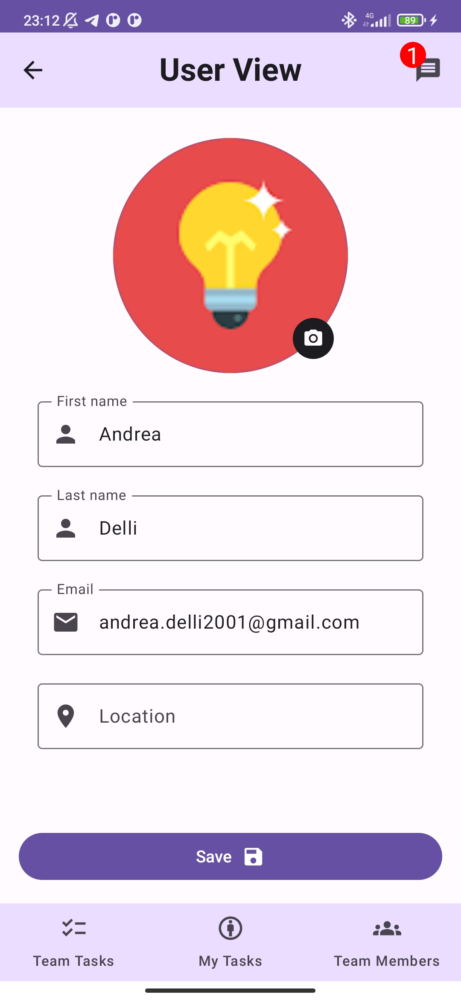

# WorkStream - A teamwork management application

A teamwork management app is designed to facilitate collaboration, communication, and coordination among team members to enhance users' overall productivity and efficiency.

By using this app, a user may manage her/his participation in one or more teams, get and set information about tasks to be performed by team members, document her/his own progress and achievements, report contributed efforts, and gather feedback from other team members as well as analytic information derived from collected data.

The goal is to streamline communication, enhance collaboration, and improve overall team performance by providing an easy to use app that keeps track of all the details of the team activity.

The app will support the following features:
- User Authentication and Profiles
  - User registration and login functionalities
  - Personal profile management
- Managing teams
  - Ability to create, edit, and delete teams
  - Sending invitations to new members via deep links and/or QR-Codes
  - Accessing the list of team members, showing profile pictures and roles
  - Option to send direct messages to other team members or to the team as a whole
  - Ability to set the degree of one's participation in a team or to withdraw from it
- Managing tasks of a team
  - Ability to create, edit, and delegate tasks to team members
  - Ability to define recurring tasks
  - Task categorization and tagging for easy identification
  - Real-time task status tracking (e.g., pending, in-progress, on-hold, completed, overdue)
  - Filter and sort options for easy navigation
- Task Details:
  - Detailed view of a selected task
  - Task title, description, assigned team member(s), and due date
  - Task state and history
  - Comments section for team communication
  - Attachments and links to related documents
- Feedback and Performance:
  - Performance metrics and analytics for individual team members
  - Visual representations of team achievements

## Login page

## Teams

## Tasks

## User profile

## Chats

## Responsive layout

## ER Model

The following diagram shows the initial design of the database schema, however to enhance collaboration and synchronization between users, Google Firebase has been used as the main backend.

